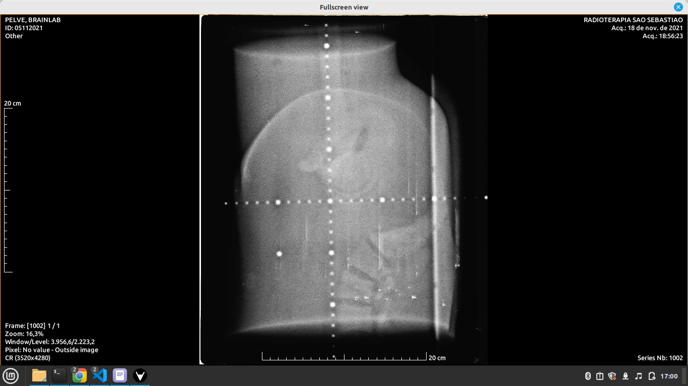
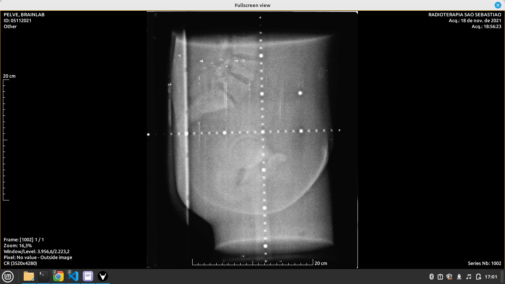
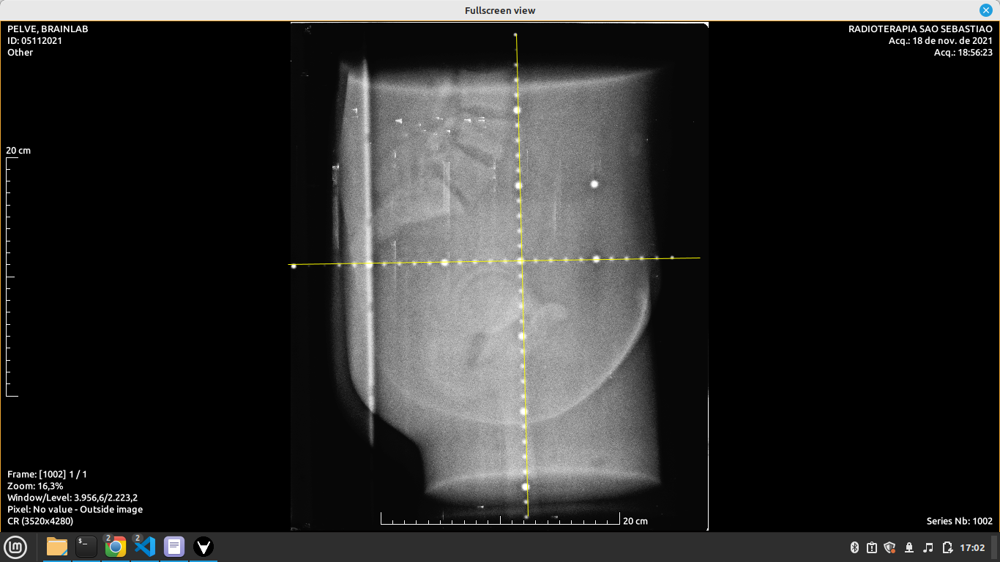

## Vaga Fullstack Developer
### Descrição do Projeto

A RT Medical desenvolve o RT Connect, um software cloud modular para a gestão de tratamento de câncer em radioterapia. Utilizamos diversas linguagens como Python, Java, C++, Rust e PHP, aproveitando o melhor de cada uma. Nossa infraestrutura é baseada em contêineres Linux, geridos pelo Docker.

Para esta vaga de desenvolvedor Fullstack, você trabalhará com PHP utilizando o framework Laravel, responsável por servir páginas web e comunicar-se com módulos via RESTful. A parte de processamento de imagens é feita em C++, enquanto Python cuida de simulações e cálculos matemáticos. Tudo isso é integrado e apresentado ao usuário via PHP/Laravel.

### Desafio
Seu desafio será criar um sistema que permita o envio de imagens DICOM através de um CRUD no backend com Laravel e exibi-las no frontend usando React e Cornerstone.js.

### Desafio Detalhado
__Objetivo__
Você deverá criar um sistema completo que permite o envio de imagens DICOM através de um CRUD (Create, Read, Update, Delete) no backend utilizando Laravel, e exibir essas imagens no frontend usando React e a biblioteca Cornerstone.js.

### Requisitos do Backend (Laravel)
___Model e Migration para Imagens DICOM:___

Crie uma model DicomImage e uma migration associada.
A migration deve incluir um campo file_path para armazenar o caminho do arquivo da imagem DICOM.
___Controlador CRUD:___

Crie um controlador DicomImageController com métodos para criar, ler, atualizar e deletar registros de imagens DICOM.
- Método index: Listar todas as imagens.
- Método store: Fazer upload de uma nova imagem DICOM.
- Método show: Exibir uma imagem específica.
- Método update: Atualizar informações de uma imagem.
- Método destroy: Deletar uma imagem.

___Rotas:___
Defina rotas RESTful para o controlador DicomImageController no arquivo routes/web.php.
___Validação e Upload de Arquivos:___
Implemente a lógica de validação para garantir que apenas arquivos DICOM sejam aceitos.
Configure o upload para salvar as imagens no sistema de arquivos e armazenar o caminho no banco de dados.

### Requisitos do Frontend (React)

___Configuração do Projeto:___

Inicialize um projeto React e instale as dependências necessárias, incluindo axios para requisições HTTP e Cornerstone.js para exibição das imagens DICOM.
___Componente de Upload:___

Crie um componente que permita aos usuários fazerem upload de imagens DICOM.
Utilize axios para enviar o arquivo para o backend.
___Componente de Lista de Imagens:___

Implemente um componente que liste todas as imagens DICOM disponíveis, com opções para visualizar, atualizar e deletar cada imagem.
___Visualização de Imagens DICOM:___

Crie um componente DicomViewer utilizando Cornerstone.js para exibir as imagens DICOM.
Carregue as imagens a partir do backend e exiba-as no visualizador.

### Imagem DICOM

1. Sua aplicação React deve ser capaz de exibir esta imagem DICOM:



### Ferramentas que devem ser implementadas:
___Crosshair de Régua___

1. Rotacione a imagem 

2. Implemente um recurso de crosshair em régua na imagem renderizada.

2. O crosshair de régua deve mostrar distâncias de 5 em 5 cm na imagem, ela ficará em cima dos pontos que já existem na imagem.

### Referências 

Para mais informações sobre a instalação e uso do Cornerstone.js, consulte os seguintes links:

- [Instalação do Cornerstone.js](https://www.cornerstonejs.org/docs/getting-started/installation)
- [Como criar um carregador de imagem personalizado](https://www.cornerstonejs.org/docs/how-to-guides/custom-image-loader)

Exemplos ao vivo podem ser encontrados aqui:

- [Exemplo básico de carregamento de imagem](https://www.cornerstonejs.org/live-examples/stackbasic)
- [Exemplo de manipulação de imagem](https://www.cornerstonejs.org/live-examples/labelmaprendering)
- [Exemplo de troca de mapa de etiquetas](https://www.cornerstonejs.org/live-examples/labelmapswapping)


___Integração com o Backend:___

Utilize axios para fazer requisições ao backend, integrando as operações CRUD no frontend.
### Fluxo de Trabalho
___Upload de Imagens:___

O usuário faz upload de uma imagem DICOM através do frontend.
A imagem é enviada para o backend, onde é validada e salva no sistema de arquivos. O caminho do arquivo é armazenado no banco de dados.
Listagem de Imagens:

O frontend faz uma requisição para o backend para obter uma lista de todas as imagens DICOM.
A lista é exibida no frontend, permitindo que o usuário visualize, atualize ou delete cada imagem.
Visualização de Imagens:

Quando o usuário seleciona uma imagem para visualização, o frontend carrega a imagem utilizando Cornerstone.js e a exibe.
___Atualização:___

O usuário pode atualizar informações ou deletar uma imagem. As alterações são refletidas no backend e no frontend.

> Na pasta docs/files possui uma imagem dicom para teste com a extensão .dcm

## Instruções
### Pré-requisitos
- Docker
- Docker Compose
- Node.js
- npm ou yarn
### Estrutura do Projeto
- readme: Documentação do projeto
- docker: Configurações do Docker
- backend: Aplicação Laravel

## Configuração do Ambiente Backend (Laravel)
### Configuração do Laravel:

Navegue até a pasta backend:
``` bash
cd backend
```
Copie o arquivo .env.example para .env e configure as variáveis de ambiente:
``` bash
echo "Copiar código"
cp .env.example .env
```
Edite o arquivo .env conforme necessário.
Configuração do Docker (Laradock):

Navegue até a pasta docker:
``` bash
cd ../docker
```
Copie o arquivo .env.example para .env e configure as variáveis de ambiente:
``` bash
cp env-example .env
```
Construção e Execução dos Contêineres:

No diretório docker, execute:
``` bash
docker-compose up -d nginx mysql workspace
```
Instalação das Dependências do Laravel:

No diretório docker, acesse o workspace:
``` bash
docker-compose exec workspace bash
```
No container do workspace, navegue até a pasta backend e instale as dependências:
``` bash
cd backend
composer install
```
Geração da Chave da Aplicação:

``` bash
php artisan key:generate
```
Migração do Banco de Dados:

``` bash
php artisan migrate
```
Acesso ao Sistema:

O backend estará disponível em http://localhost.
## Configuração do Ambiente Frontend (React)

Criar Model e Migration para Imagem DICOM:

``` php
php artisan make:model DicomImage -m
```
Definir Estrutura da Migration:

``` php
Schema::create('dicom_images', function (Blueprint $table) {
    $table->id();
    $table->string('file_path');
    $table->timestamps();
});
```
Criar Controller para o CRUD:

``` php
php artisan make:controller DicomImageController --resource
```
Definir Rotas no routes/web.php:

``` php
Route::resource('dicom-images', DicomImageController::class);
```
Implementar Métodos no Controller:

Implemente os métodos index, create, store, show, edit, update, destroy.
Frontend (React)
Instalação da Biblioteca Cornerstone.js:

``` php
npm install cornerstone-core cornerstone-tools cornerstone-math dicom-parser
```
Implementação do Componente para Exibir Imagens DICOM:

``` jsx
import React, { useEffect, useRef } from 'react';
import cornerstone from 'cornerstone-core';
import dicomParser from 'dicom-parser';

const DicomViewer = ({ imageUrl }) => {
    const elementRef = useRef();

    useEffect(() => {
        cornerstone.enable(elementRef.current);
        cornerstone.loadImage(imageUrl).then(image => {
            cornerstone.displayImage(elementRef.current, image);
        });
    }, [imageUrl]);

    return <div ref={elementRef} style={{ width: '512px', height: '512px' }}></div>;
};

export default DicomViewer;
```
Conectar Frontend com Backend:

Utilize axios para fazer requisições HTTP ao backend.
``` bash
npm install axios
``` 
```  jsx
Copiar código
import axios from 'axios';

const fetchImages = async () => {
    const response = await axios.get('http://localhost/dicom-images');
    // processar resposta
};

useEffect(() => {
    fetchImages();
}, []);

``` 
## Submissão
- Faça um fork deste repositório e trabalhe no seu fork.
- Crie uma nova branch com o nome desafio-nome-sobrenome.
- Após finalizar o desafio, faça um pull request para o repositório original.
## Avaliação
- Você será avaliado pela correta implementação dos requisitos, bem como pela organização e estrutura do seu código.
- Esta etapa é eliminatória. Caso aprovado, você será convocado(a) para uma entrevista remota ou presencial com a equipe técnica.
## Sobre o processo
- O processo de contratação será em 3 etapas:
1. Análise de currículo
2. Realização do desafio
3. Entrevista
> Mesmo que não consiga implementar todas as funcionalidades solicitadas no desafio, recomendamos que você submeta o pull request. Na descrição do pull request, conte-nos qual foi a maior dificuldade que você enfrentou e como tentou resolver o problema. A sinceridade em relatar os desafios e dificuldades também será considerada na avaliação.


### Recursos Úteis
- [Tutorial de Laravel com React] (https://adevait.com/laravel/using-laravel-with-react-js)
- [FreeCodeCamp: Usando React com Laravel] (https://www.freecodecamp.org/news/use-react-with-laravel/)
- [API Laravel + React - Projeto e Configuração] (https://matheussg.medium.com/api-laravel-react-js-parte-1-projeto-arquitetura-e-configura%C3%A7%C3%A3o-d2b8e77cde7d)
- [Vídeo Tutorial sobre Laravel e React] (https://www.youtube.com/watch?v=P7dEmQXegB4)

Boa sorte!